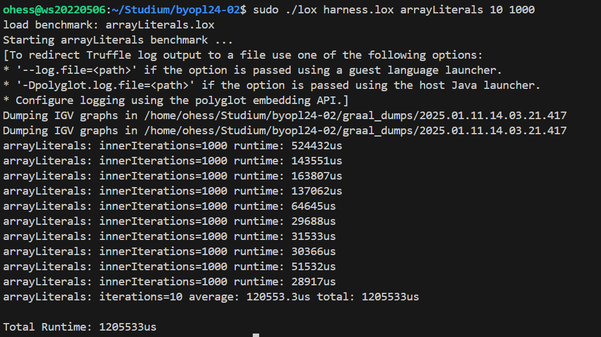
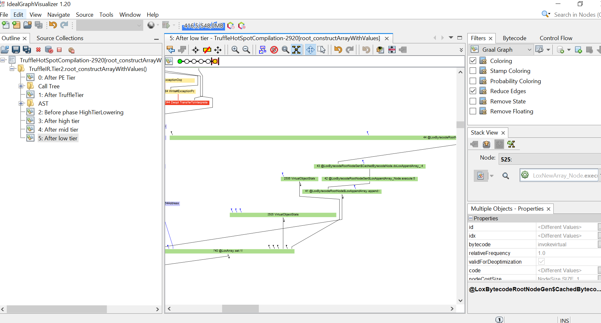
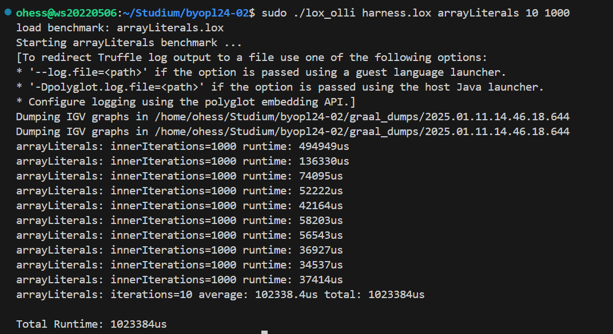
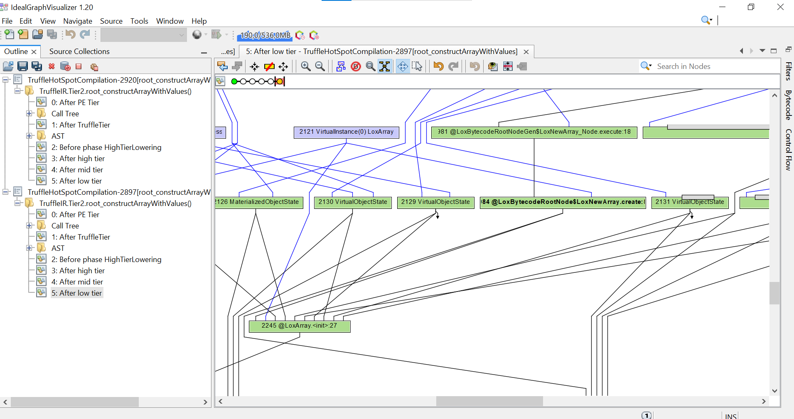

# Initial Implementation of the Array Literal Bonus Feature

Written benchmark: [`../../arrayLiterals.lox`](../../arrayLiterals.lox)

Executed by Oliver in WSL environment

Sample of benchmark output

We initially implemented the array literals bonus feature by continously appending the elements.
Here is what we found in IGV (only a small snippet of the graph because it contains lots of interal "AMD64Adress" and "memory" stuff...)

# Optimization

We optimized the feature by getting rid of the appending and just use `@Variadic` Annotation for a variable amount of arguments for the `LoxNewArray` Operation.

Sample of optimized benchmark output

So we can detect a small improvement regarding this micro benchmark.

Overall the IGV is now much smaller and also we can only detect a single array init including all given initial values.

